.. include:: <s5defs.txt>

======================
Introduction to Python
======================

:Author:  Andrew Montalenti
:Date:    $Date: 2011-06-15 09:00:00 -0500 (Tues, 15 Jun 2011) $

.. This document is copyright Andrew Montalenti and Aleph Point, Inc.

.. container:: handout

    **How this was made**

    This document was created using Docutils_/reStructuredText_ and S5_.

    It is the introductory Python course given by Aleph Point, Inc. to
    the newest generation of Python hackers.

    Simplicity begets elegance.

.. _Docutils: http://docutils.sourceforge.net/
.. _reStructuredText: http://docutils.sourceforge.net/rst.html
.. _S5: http://meyerweb.com/eric/tools/s5/

.. container:: handout

    **Exercises**

    Exercises for this book are taken from five primary sources. These are:
            * Zed Shaw's excellent book, `Learn Python the Hard Way`_, known affectionately as LPTHW
            * `Google's Python Class`_, available on Google Code
            * `Intermediate and Advanced Software Carpentry with Python`_, an online course by C. Titus Brown
            * `Dive Into Python`_, by Mark Pilgrim
            * `Python Cookbook, 3rd Edition`_, by David Beazley and Brian K. Jones

.. _Learn Python the Hard Way: http://learnpythonthehardway.org
.. _Google's Python Class: http://code.google.com/edu/languages/google-python-class/
.. _Intermediate and Advanced Software Carpentry with Python: http://ivory.idyll.org/articles/advanced-swc/
.. _Dive Into Python: http://diveintopython.org/
.. _Python Cookbook, 35rd Edition: http://shop.oreilly.com/product/0636920027072.do

Read slides on your own
-----------------------

http://pixelmonkey.org/pub/python-training

Meta Information
----------------

**Me**: I've been using Python for 10 years. I use Python full-time, and have for the last 3 years. I'm the founder/principal at `Aleph Point`_, an agile software engineering consulting and training firm. I'm also the co-founder/CTO of Parse.ly_, a tech startup in the digital media space.

**E-mail me**: andrew@alephpoint.com

**Follow me on Twitter**: amontalenti_

**Connect on LinkedIn**: http://linkedin.com/in/andrewmontalenti

.. _Aleph Point: http://alephpoint.com
.. _Parse.ly: http://parsely.com
.. _amontalenti: http://twitter.com/amontalenti

Other skills are fair game, too
--------------------------------

    * Java
    * Groovy
    * JavaScript
    * SVN / Mercurial
    * Web development
    * Computer Science
    * ...

Slide Zero
-----------

Simplicity begets elegance.

---------------------

.. sourcecode:: python

    >>> nums = [45, 23, 51, 32, 5]
    >>> for idx, num in enumerate(nums):
    ...    print idx, num
    0 45
    1 23
    2 51
    3 32
    4 5

Simplicity
----------

.. class:: incremental

    Beautiful is better than ugly.

    Explicit is better than implicit.

    Simple is better than complex.

    Complex is better than complicated.

Readability
-----------

.. class:: incremental

    Flat is better than nested.

    Sparse is better than dense.

    Readability counts.

    Special cases aren't special enough to break the rules.

    Although practicality beats purity.

Predictability
--------------

.. class:: incremental

    Errors should never pass silently.

    Unless explicitly silenced.

    In the face of ambiguity, refuse the temptation to guess.

    There should be one-- and preferably only one --obvious way to do it.

    Although that way may not be obvious at first unless you're Dutch.

Practicality
------------

.. class:: incremental

    Now is better than never.

    Although never is often better than *right* now.

    If the implementation is hard to explain, it's a bad idea.

    If the implementation is easy to explain, it may be a good idea.

    Namespaces are one honking great idea -- let's do more of those!

The Zen of Python
-----------------

It's embedded in the heart of the language.

.. sourcecode:: python

    >>> import this
    The Zen of Python, by Tim Peters

    Beautiful is better than ugly.
    Explicit is better than implicit.
    ...

Principles behind Python
------------------------

Time to a solution is determined by:
    * how long writing a program takes (*human time*)
    * how long it takes that program to run (*machine time*)

Every language was written with a tradeoff between these:
    * Java
    * C
    * C++
    * Perl
    * MATLAB

Time spent developing
---------------------

Watch out for the increasing human cost of a project as time goes on!

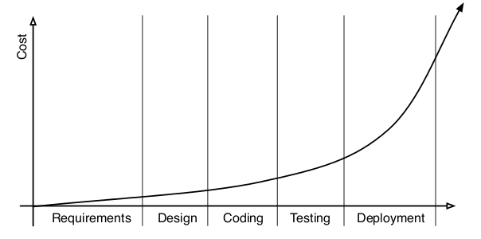

Didier's decision
-----------------

Didier is a Parse.ly cofounder and my favorite Python engineer on the planet.

.. class:: incremental

    My choices at the time were `Java (the Eclipse-driven language),` `C (a
    language of last resort),` `C++ (a language that comes with reference
    book),` `Perl (a Babylonian language),` `and Matlab (closed source).`

    `At the time, I was done with computer science and I needed a language
    that I could use for` `prototyping, like Matlab was,` `but more
    general.`

Python meets expectations
--------------------------

There are many programming languages that meet the minimum criteria
for a strong platform for modern software development. Python, like
many of those options, is:

.. class:: incremental

    * free and open source
    * cross-platform
    * widely-used and well-supported
    * well-documented

...and then exceeds them
-------------------------

Python is unique in that it also has:

.. class:: incremental

    * an enormous standard library
    * a vibrant third-party development ecosystem
    * a wide acceptance for web development
    * a slew of academic programming libraries (bioinformatics, NLP)
    * several options for increasing performance

My Job
-------

My job is easy because Python was built as a teaching language.

I learned Python using an online book called *Dive Into Python*, by Mark Pilgrim.

The concept behind that book is that Python is such a readable language, that
we can learn it by reading well-written Python programs.

We'll try to use this approach to good effect.

I have an opinion, and so will you
----------------------------------

Python is an opinionated language, and I have an opinion about code.

In this class, you will learn to write opinionated code that has good style.

Our first program
-----------------

.. sourcecode:: python

    >>> nums = [45, 23, 51, 32, 5]
    >>> for idx, num in enumerate(nums):
    ...    print idx, num
    0 45
    1 23
    2 51
    3 32
    4 5

Dissection
----------

.. sourcecode:: python

    >>> nums = [45, 23, 51, 32, 5]

.. class:: incremental

    Declares a *label* called ``nums``, and *binds* it to a ``list`` value.

    Could just as easily be written this way, although no Pythonista would ever do this.

.. sourcecode:: python

    >>> nums = list()
    >>> nums.append(45); nums.append(23)
    >>> nums.append(51); nums.append(32)
    >>> nums.append(5)

The verbosity of Java
---------------------

Contrast to Java:

.. sourcecode:: java

    // Java code
    List<Integer> nums = new ArrayList<Integer>();
    nums.add(45); nums.add(23);
    nums.add(51); nums.add(32);
    nums.add(5);

Or, at best:

.. sourcecode:: java

    List<Integer> nums =
        Arrays.asList(new Integer[] {45, 23, 51, 32, 5});

Concise syntax is Pythonic
---------------------------

.. class:: incremental

    In Java, I have even tapped into some obscure features, using ``Arrays.asList`` to initialize the ``ArrayList``, leveraging the fact that arrays, but not lists, have a concise initialization syntax.

    In Python, lists are declared using ``[item1, item2, item3, ...]``, a simple and concise syntax that can be easily read.

    This is but one example of *hundreds* made in the language.

Dissection (con't)
------------------

.. sourcecode:: python

    >>> for idx, num in enumerate(nums):

*Iterates* over each item in the ``nums`` list, yielding a ``tuple`` for each
iteration step that contains the *index of the list value* and the *list value* itself.

.. sourcecode:: python

    >> list(enumerate(nums))
    [(0, 45), (1, 23), (2, 51), (3, 32), (4, 5)]

Dissection (still con't)
------------------------

.. sourcecode:: python

    ... print idx, num

The ``for`` loop has created two new *bindings*, ``idx`` and ``num``, for each iteration step of the loop. These bindings are *unpacked* from the tuples yielded by the ``enumerate`` built-in function.

Dissection (final)
------------------

We can break this down by looking at how one step would work.

.. sourcecode:: python

    >>> idx, num = (0, 45)
    >>> idx
    0
    >>> num
    45
    >>> print idx, num
    0 45

Welcome to Python!
------------------

Two readable lines of code that do a whole lot of work for you. You've already
been subtly exposed to some features we'll learn about in the upcoming course:

    * concise list syntax
    * variable bindings and scope
    * tuples
    * iterators (and even generators!)
    * value unpacking
    * ``print`` keyword

Development Environment Setup
-----------------------------

Behind every good Python programmer is a good development environment.

For this course, I've suggested your company set up the following tools:

.. class:: incremental

    * **Python 2.7**: the latest "stable/prod" version of Python
    * **IPython**: an interactive Python shell
    * **pip**: python's package manager
    * **IPython Notebook**: a browser-based Python REPL and interactive environment

Python, IPython, IPython Notebook
---------------------------------

One of Python's best features is the REPL loop, or **Read**, **Evaluate**, **Print** **Loop**.

Open source developers have created a number of "enhanced" REPLs over the years. The most common of these is **IPython Notebook**, but there is also regular old **IPython** as well as others.

BREAK: Confirm system settings
------------------------------

... cue elevator music ...

The basics
----------

In traditional compiled languages like C/C++, you think about *user programs* which run directly on the operating system.

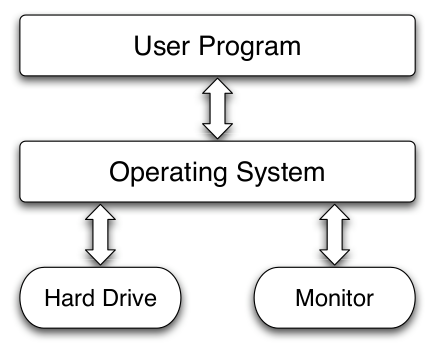

Python shell
------------

Python introduces one more layer of abstraction, the *Python interpreter*, that is like a mini operating system running above the actual operating system.

There is no separate "compilation" step like C/C++/Java.

You simply run the ``python`` command, and you can start evaluating code.

.. sourcecode:: python

    >>> print 1 + 2
    3
    >>> print 'charles' + 'darwin'
    charlesdarwin

Python runtime
--------------

The ``python`` command, when run with no arguments, opens the interactive
shell.

When run *with* arguments, it acts as a runtime for code that can be stored
in files or provided at the command line.

.. sourcecode:: bash

    python -c "print 1 + 2"
    python myprog.py

EXERCISES: Write our first programs
------------------------------------

    * http://blamcast.net/python/ex1.html
    * http://blamcast.net/python/ex2.html
    * http://blamcast.net/python/ex3.html
    * http://blamcast.net/python/ex4.html
    * http://blamcast.net/python/ex5.html

Label assignment
----------------

.. sourcecode:: python

    >>> planet = 'Sedna'
    >>> print plant # note the deliberate misspelling
    Traceback (most recent call last):
        print plant
        NameError: name 'plant' is not defined
    >>>

Must assign a value to a label before it can be used. No compile-time check
that label has already been assigned, so mis-spelled label name raises a
``NameError`` exception. *This is a common source of bugs*.

Strong typing
-------------

.. class:: incremental

    Though labels can be re-assigned among types at will, the actual *values* behind the labels do have types.

    And Python does not go out of its way to coerce types that cross "semantic boundaries".

Minimal automatic coercion
--------------------------

.. sourcecode:: python

    >>> string = "two"
    >>> number = 3
    >>> string, number = number, string # swap values
    >>> print string + number
    Traceback (most recent call last)
        string + number
        TypeError: cannot concatenate 'int' and 'str' objects

.. class:: incremental

    This makes Python a *dynamic, but strongly typed* language. Contrast with Perl, which is *both dynamic and weakly typed*.

Indentation
-----------

"Wait a second. Are you serious? Whitespace is *significant* in Python?"

"Where the hell are my curly braces!?"

.. sourcecode:: python

    >>> from __future__ import braces
    SyntaxError: not a chance (<ipython console>, line 1)

You heard the interpreter.

Why indentation?
----------------

.. class:: incremental

    Short answer: because we do it anyway.

    Better answer: because some of us don't.

    `Python Style Guide (PEP 8)`_ specifies 4 spaces, and no tab characters.

.. _Python Style Guide (PEP 8): http://www.python.org/dev/peps/pep-0008/

Line continuation
-----------------

One problem with significant indentation is how to break long statements on multiple lines.

Python has two options:

    * The ``\`` character, which indicates that the end of a line has been reached and tells the interpreter to treat the next line as a continuation of the current line; best to avoid this one if possible
    * The ``(...)``, ``{...}`` and ``[...]`` characters, which create an implicit continuation; use this one if possible

Empty statements
----------------

Another problem with indentation is that it makes it harder to specify "empty statements". e.g., in JavaScript ``function() {}`` represents an "empty function". Python does this with a special keyword called ``pass``, that simply does nothing. An example:

.. sourcecode:: python

    if normal_condition:
        do_something_normal()
    elif special_condition:
        pass
    else:
        do_default()

The middle condition is a "no-op". It's also used for stubs, e.g.:

.. sourcecode:: python

    def placeholder(): pass

Line continuation example
-------------------------

.. sourcecode:: python

    # prefer this:
    "{foo} {bar} {baz}".format(
        foo=foo, bar=bar, baz=baz)
    # to this:
    "{foo} {bar} {baz}"\
        .format(foo=foo, bar=bar, baz=baz)

Documentation built-in
----------------------

.. sourcecode:: python

    >>> import string
    >>> dir(string)
    ['__builtins__', '__doc__', ..., 'atof', 'atof_error', 'atoi', ...]
    >>> print string.count.__doc__
    count(s, sub[, start[,end]]) -> int

        Return the number of occurrences of substring sub in string
        s[start:end].  Optional arguments start and end are
        interpreted as in slice notation.

help function
-------------

With no arguments, the ``help`` function opens an interactive help prompt.

But usually, you only need help on a specific function or module. So, then you
can call ``help`` with an argument.

Example of help
---------------

.. sourcecode:: python

    >>> import string
    >>> help(string)
    Help on module string:

    NAME
        string - A collection of string operations...

    FILE
        /usr/lib/python2.6/string.py

    MODULE DOCS
        http://docs.python.org/library/string

    ...

Printing
--------

.. sourcecode:: python

    >>> print "Hello World!"
    Hello World!
    >>> cars = 100
    >>> print "There are", cars, "available"
    There are 100 cars available
    >>> print??
    Type:       builtin_function_or_method
    ...
        print(value, ..., sep=' ', end='\n', file=sys.stdout)
            Prints the values to a stream, or to sys.stdout by default.

Comments
--------

.. sourcecode:: python

    #!/usr/bin/env python
    # Written by John Doe, 6/5/2011
    #
    if __name__ == "__main__": # only runs when script is executed
        """This comment can span multiple
        lines
        """
        print "Hello, World"

Math and Numbers
----------------

.. sourcecode:: python

    >>> x = 3
    >>> 1 < x < 3
    False
    >>> 2 < x < 5
    True
    >>> 3 == x
    True
    >>> x + 0.1
    3.1000000000000001

Python number literals are either ``int`` or ``float``, depending on context. If an expression is a ``float``, IEEE 754 floating point rules apply. Otherwise, normal integer math rules apply.

Float context
-------------

.. sourcecode:: python

    >>> type(0.1)
    <type 'float'>
    >>> type(3)
    <type 'int'>
    >>> type(3 + 0.1)
    <type 'float'>

Decimals
--------

.. sourcecode:: python

    >>> from decimal import Decimal as D
    >>> D("3") + D("0.1")
    Decimal('3.1')
    >>> D("3") + D("0.1") == D("3.1")
    True

When dealing with non-scientific computations, you probably want to use the ``Decimal`` class. It is a little awkward to use -- you must specify your numbers as strings. However, it supports all expected operations directly on the Decimal object.

To make it a little easier to use, I imported it using a module alias ``D``.

Formatting
----------

There are a few ways to do string formatting in Python, though one is preferred.
``str.format`` is a method on ``str`` that provides a full complement of
string formatting features.

.. sourcecode:: python

    >>> "{num} cars crossed the intersection \
        in the last {hrs} hours".format(num=5, hrs=24)
    5 cars crossed the intersection in the last 24 hours

``%``, defined on ``str`` objects, is sometimes used in older code for basic
string formatting.

.. sourcecode:: python

    >>> "%s cars crossed the intersection \
        in the last %s hours" % (5, 24)
    5 cars crossed the intersection in the last 24 hours

Strings
-------

.. class:: incremental

    There are many programmers for whom strings play a much more vital role than number types.

    I am one of those programmers.

    My applications deal with the web and with large-scale text processing.

    A core understanding of strings and a language with capabilities to manipulate them is critical to get work done in this environment.

The str literal
---------------

In Python, strings can be enclosed with single, double, or *triple* quotes.

.. sourcecode:: python

    >>> 'single'
    'single'
    >>> "double"
    'double'
    >>> """triple"""
    'triple'
    >>> """though single and double are mostly interchangeable,
    triple quotes have a special property: they ignore line
    breaks. Thus, they can be used as a kind of 'heredoc'."""
    "though single and double are mostly interchangeable,\n triple ..."

Special str modes
-----------------

They may also be preceded with a special character prefix, indicating a special string mode. Currently, only two are supported: *raw* strings using prefix ``r``, and *unicode* strings using prefix ``u``.

.. sourcecode:: python

    >>> print('C:\new\node\nell.exe')
    C:
    ew
    ode
    ell.exe
    >>> print(r'C:\new\node\nell.exe')
    C:\new\node\nell.exe
    >>> print(u"\u2192")
    →

str methods
-----------

Strings support a healthy number of methods, including:

    * common transformations like ``lower`` and ``upper``
    * conveniences like ``strip`` and ``startswith``
    * utilities like ``find``, ``replace``, ``split``, and ``join``

.. sourcecode:: python

    >>> ". ".join("PYTHON IS GREAT".lower().split()) + "."
    python. is. great.

str operators
-------------

Strings also support some great operators:

    * ``+`` for concatenation
    * ``[idx]`` for slicing
    * ``*`` for repeating
    * ``in`` for substring matching

.. sourcecode:: python

    >>> p = "PYTHON"
    >>> g = ("GREAT " * 3).strip()
    >>> "GREAT" in g
    True
    >>> p + (" %s " % "IS") + g[0:15] + "..."
    'PYTHON IS GREAT GREAT GRE...'

Method chaining
---------------

When methods are chained, the intermediary results of computation are simply discarded.

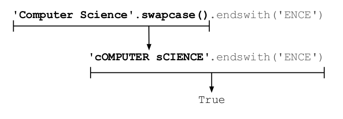

Built-in namespace
------------------

.. class:: incremental

    Python automatically imports a slew of functions, types, and symbols, which are known collectively as *built-ins*.

    These provide the "basic language constructs" before you start referencing the modules of the standard library.

.. sourcecode:: python

    >>> sorted(vars(__builtins__).keys())[-5:]
    ['tuple', 'type', 'unichr', 'unicode', 'vars', 'xrange', 'zip']
    >>> sorted is __builtins__.sorted
    True

Built-in functions
------------------

Built-in functions are covered in this document:

http://docs.python.org/library/functions.html

Some early ones to look at are:

.. class:: incremental

    * ``all`` and ``any`` for applying boolean filters to lists
    * ``dict``, ``list``, ``set``, and ``object``, all of which will be covered later
    * ``hasattr``, ``getattr``, and ``setattr``, which are used for metaprogramming
    * ``sorted`` and ``reversed`` for sorting lists
    * ``int``, ``str``, and ``float``, which act as type constructors and coercers
    * ``min``, ``max``, and ``sum`` for common list math

All objects are first-class
---------------------------

.. sourcecode:: python

    >>> line = "GOOG,100,490.10"
    >>> field_types = [str, int, float]
    >>> raw_fields = line.split(",")
    >>> fields = [ty(val) for ty, val in zip(field_types, raw_fields)]
    >>> fields
    ['GOOG', 100, 490.1000000000002]

The fact that everything in Python is first-class is often not fully appreciated by new programmers.

How would you have written this in Java/C#?

EXERCISES: Strings, Printing and Input
--------------------------------------

    * http://blamcast.net/python/ex6.html
    * http://blamcast.net/python/ex11.html
    * http://blamcast.net/python/ex12.html

True, False, and None
---------------------

Among the imported symbols from ``__builtins__`` are ``True``, ``False``, and ``None``.

These core symbols used in boolean logic, and are typically utilized with keywords such as ``is``, ``not``, ``and``, ``or``, etc.

Object equality and identity
----------------------------

.. sourcecode:: python

    >>> x, y = (0, 1)
    >>> y == True # aka, "y is truthy"
    True
    >>> x == False # aka, "x is falsy"
    True
    >>> y is True # aka, "y is True singleton"
    False
    >>> x is False # aka, "x is False singleton"
    False
    >>> y is not True
    True
    >>> y is not False
    True

Control structures
------------------

.. sourcecode:: python

    if login_method == "admin" or user.staff:
        print "allow login for admin"
    elif authenticate(username, password):
        print "allow login for user"
    else:
        raise AuthenticationError

Truth tables
------------

Logical operations can be visualized with a truth table.

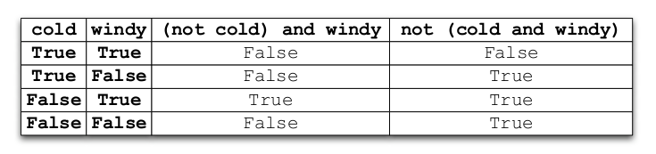

Lack of switch statement
------------------------

.. sourcecode:: java

    // Java code
    switch (file.getType()) {
        case FileTypes.HTML:
            return "HTML Document";
        case FileTypes.DOC:
            return "MS Word";
        case FileTypes.EXCEL:
            return "MS Excel";
        default:
            return null;
        // ...
    }

Using an elif chain
--------------------

.. sourcecode:: python

    ftype = file.type
    if ftype == "text/html":
        return "HTML Document"
    elif ftype == "application/ms-word":
         return "MS Word"
    elif ftype == "application/ms-excel":
        return "MS Excel"
    else:
        return None

Lists
-----

.. sourcecode:: python

    >>> x = []
    >>> x.append(5)
    >>> x.extend([6, 7, 8])
    >>> x
    [5, 6, 7, 8]
    >>> x.reverse()
    >>> x
    [8, 7, 6, 5]

Lists and memory
----------------

Lists are reference types, which means they simply contain pointers to objects that exist elsewhere.

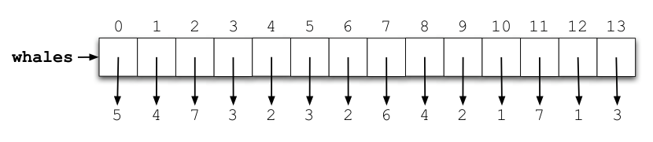

List alterations
----------------

Lists can be altered (mutated) at will, which does not require recreation of the entire list.

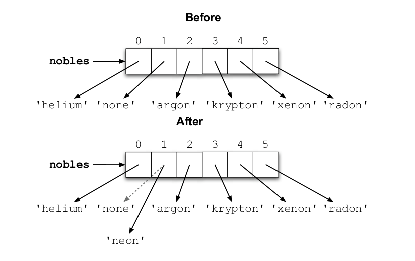

List concatenation
------------------

Lists can be concatenated with other lists using ``extend``, which creates a new list but does not require reallocating all the data.

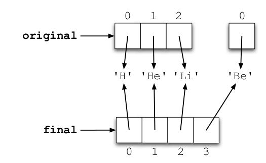

List slicing
------------

Lists (and other "sequences") have a convenient syntax for accessing single elements or even ranges of elements. This is called *slicing* and can also be done with the ``slice`` builtin function or ``[i:j:step]`` syntax.

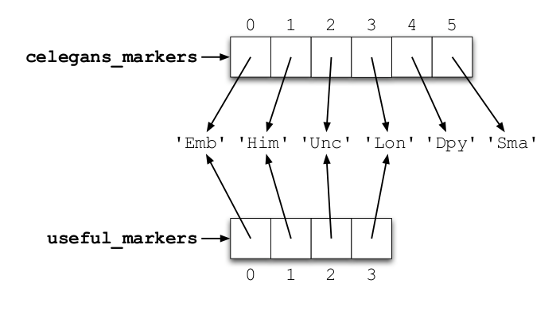

.. sourcecode:: python

    record = '....................100 .......513.25 ..........'
    cost = int(record[20:32]) * float(record[40:48])

List aliasing
-------------

Lists and other so-called "mutable objects" can be aliased simply by binding a new label to the list. This sometimes leads to bugs!

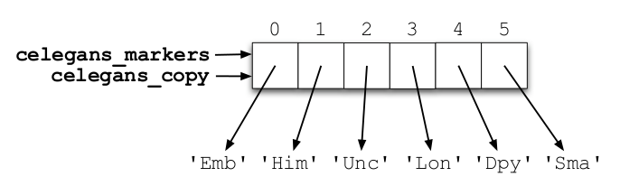

List nesting
------------

Lists can also be arbitrarily nested, or contain other types altogether like tuples, sets, or dictionaries.

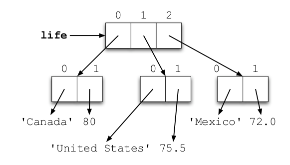

Dictionaries
------------

.. sourcecode:: python

    >>> d = {}
    >>> d['a'] = 5
    >>> d['b'] = 4
    >>> d['c'] = 18
    >>> d
    {'a': 5, 'c': 18, 'b': 4}
    >>> d['a']
    5
    >>> e = dict(a=5, b=4, c=18)
    >>> e
    {'a': 5, 'c': 18, 'b': 4}

Dictionary visually
-------------------

Dictionaries contain a "magically stored" set of *items*, which are key to value mappings.

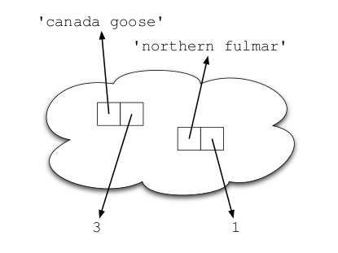

Switch statement to dictionary
------------------------------

.. sourcecode:: python

    long = file.type
    long2short = {
        "text/html": "HTML Document"
        "application/ms-word": "MS Word"
        "application/ms-excel": "MS Excel"
    }
    print long2short.get(long, None)

Sets
----

.. sourcecode:: python

    >>> ppl = {"Andrew", "Joe", "Bob", "Joe", "Bob", "Andrew"}
    >>> print ppl
    set(["Andrew", "Joe", "Bob"])
    >>> trainers = {"Andrew"}
    >>> print ppl - trainers
    set(["Joe", "Bob"])

Sets visually
-------------

Similarly to dictionaries, sets "magically" store their values. Since sets can only store unique (hashable) values, it will remove duplicates from other collections like lists. Sets also support fast set operations like union, intersection, addition and subtraction.

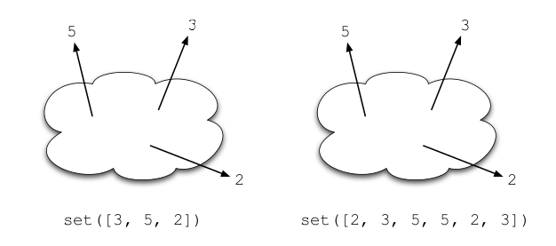

Using ``in`` with dicts and sets (1)
------------------------------------

Good:

.. sourcecode:: python

    for key in d:
        print key

Bad:

.. sourcecode:: python

    for key in d.keys():
        print key

Use ``in`` where possible (2)
-----------------------------

.. class:: incremental

   For consistency, use ``key in dict``, not ``dict.has_key()``::

       # do this:
       if key in d:
           text = d[key]

       # not this:
       if d.has_key(key):
           text = d[key]

Think data, not code
--------------------

.. class:: incremental

    * Java / C++ / VB programmers coming to Python often bring their
      language-specific idioms with them
    * Leverage Python's strongest features to make your code cleaner, shorter, and more readable
    * ``switch`` statements are better written as dictionaries
    * Avoid crutches you used to use because you had to

Tuples
------

.. class:: incremental

    A ``list`` is a mutable heterogeneous sequence

    A ``tuple`` is an immutable heterogeneous sequence

    i.e., a list that can't be changed after creation

    Why provide a less general type of collection?

Tuple example
-------------

.. sourcecode:: python

    >>> primes = (2, 3, 5, 7)
    >>> print primes[0], primes[-1]
    2 7
    >>> empty_tuple = ()
    >>> print len(empty_tuple)
    0
    >>> one_tuple = (0,)
    >>> print len(one_tuple)
    1

Must use ``(val,)`` for one-tuples, due to some grammar ambiguity. ``(...)`` overloaded for tuples, function invocation syntax, and operator grouping!

Tuples very handy for nested sequences
--------------------------------------

.. sourcecode:: python

    >>> pairs = ((1, 10), (2, 20), (3, 30), (4, 40))
    >>> for low, high in pairs:
    ...   print low + high
    ...
    11
    22
    33
    44

``enumerate`` for indexed iteration
------------------------------------

.. sourcecode:: java

    // Java code
    List<String> colors = new ArrayList<String>();
    colors.add("yellow"); colors.add("magenta"); // ...
    for (int i = 0; i < colors.size(); i++) {
        String color = colors.get(i);
        System.out.println(i + " " + color);
    }

Quite a contrast when you compared to this!

.. sourcecode:: python

    # Python code
    >>> items = ['yellow', 'magenta', 'lavender']
    >>> for i, name in enumerate(colors):
    ...   print i, name

Sequence protocol
-----------------

A Python *sequence* is any type that supports these operations:

.. class:: incremental

    * ``len``, for counting number of items in container
    * ``s[i]``, for getting the i'th element of sequence
    * ``s[i:j]``, for slicing from i to j in container
    * ``s[i:j:step]``, for slicing from i to j, skipping to every index that is a multiple of 'step'

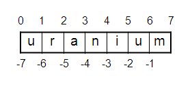

Sequence examples
-----------------

Examples of sequences:

.. class:: incremental

    * lists
    * tuples
    * strings

EXERCISES: Lists and Sorting
----------------------------

    * http://blamcast.net/python/ex32.html
    * http://blamcast.net/python/ex33.html
    * http://blamcast.net/python/ex34.html

EXERCISES: Dictionaries and logic
---------------------------------

    * http://blamcast.net/python/ex40.html
    * http://blamcast.net/python/ex41.html

Functions
---------

.. sourcecode:: python

    def divide(a, b):
        """Divides operands a and b using integer division.
        Returns a quotient and remainder of division
        operation in a 2-tuple."""
        q = a // b
        r = a - q*b
        return q, r

.. class:: incremental

    * the triple-quoted string on the first line is a special form of Python
      documentation known as a *docstring*
    * the ``//`` operator is integer division
    * the ``return q, r`` statement shows Python's concise syntax for
      returning multiple values by returning a tuple

Using functions
---------------

.. sourcecode:: python

    >>> from mymath import divide
    >>> help(divide)
    Help on function divide in module mymath:

    divide(a, b)
        Divides operands a and b using integer division.
        Returns a quotient and remainder of division
        operation in a 2-tuple.
    ...

``def`` is like any other statement
-----------------------------------

Logic flows around the function body, then re-enters it upon invocation.

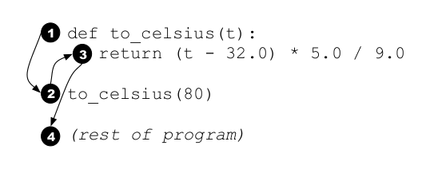

Calling functions
------------------

.. sourcecode:: python

    >>> divide(5, 2)
    (2, 1)
    >>> quotient, remainder = divide(5, 2)
    >>> print "quotient is %s, remainder is %s" \
    ...     % (quotient, remainder)
    quotient is 2, remainder is 1
    >>> return_value = divide(5, 2)
    >>> print "quotient is %s, remainder is %s" \
    ...     % return_value
    quotient is 2, remainder is 1

Keyword arguments
-----------------

.. sourcecode:: python

    def connect(host, port=80, scheme="http", timeout=300):
        http = HTTPClient()
        http.connect("{scheme}://{domain}:{port}".format(
            scheme=scheme,
            domain=domain,
            port=port), timeout=timeout)
        return http

.. class:: incremental

    * The first argument is known as a *positional* or *required*
      argument.
    * The latter 3 are known as *keyword* or *optional* arguments.

Argument types
--------------

.. class:: incremental

    * Required arguments will always have the value passed during function call
    * There is no way to restrict argument type
    * Eagerly checking for an argument type is an *anti-pattern* in Python
    * Instead, Pythonistas prefer what is known as *duck typing*

Type checking anti-pattern
--------------------------

.. sourcecode:: python

    def connect(domain, port=80, scheme="http", timeout=300):
        if not isinstance(domain, basestring):
            raise ValueError("domain must be a string")
        if not isinstance(port, int):
            raise ValueError("port must be an integer")
        if not isinstance(timeout, int):
            raise ValueError("timeout must be an integer")

Why is this bad?
----------------

In many languages and communities, the code on the last slide isn't bad.

But, in the Python community, it is.

Arbitrary rigidity
------------------

The reason for this is a distaste for arbitrary rigidity:

.. class:: incremental

    * Python's dynamism leads to its flexibility
    * does your function really rely on the ``list`` type, or does it just need something that is *list-like* (e.g. a set), namely, that supports iteration?
    * does your function really rely on the ``file`` type, or does it just need something that is *file-like* (e.g. a buffer), namely, that supports reading?

Take a deep breath
------------------

This concept, *duck typing*, is near and dear to many a Pythonista's heart.

"If it looks like a duck and quacks like a duck, then it must be a duck!"

Eager checking anti-pattern
---------------------------

.. sourcecode:: python

    def connect(domain, port=80, scheme="http", timeout=300, client=None):
        if client is not None:
            http = client
        else:
            http = HTTPClient()
        # ... setup as before ...
        if not hasattr(http, "connect"):
            raise ValueError("client missing connect attribute")
        if not callable(http.connect):
            raise ValueError("client's connect isn't a method")
        http.connect("...")
        return http

Why is that bad?
----------------

Though eager checking is a virtue in many communities (e.g. Java), in Python, this is very much looked down upon.

Python is built on a different principle known affectionately in the community as **EAFTP**. That's: **"Easier to Ask For Forgiveness Than Permission"**

Be brave, we're all adults here
-------------------------------

.. class:: incremental

    In the code on the last slide, it was like we were walking on eggshells with the value passed to us by the user of the function.

    The error messages are nice, the code is correct, but the essence of the function is polluted by the excessive checking.

    *Why not just try to do what your function expects?*

Forgiving, but not pedantic, code
---------------------------------

.. sourcecode:: python

    def connect(domain, port=80, scheme="http", timeout=300, client=None):
        if client is not None:
            http = client
        else:
            http = HTTPClient()
        try:
            http.connect("...")
        except (AttributeError, TypeError) as ex:
            log.error("client may not support protocol")
            raise ex

One more deep breath
--------------------

.. class:: incremental

    EAFTP is another concept near-and-dear to a Pythonista's heart.

    The general idea is, rely more on exceptions and exception handling, than on validation and checking.

    In addition to code cleanliness benefits, this often has performance benefits, too!

Quirks of optional arguments
----------------------------

.. class:: incremental

    * Optional arguments must be declared after required ones, and must have default values
    * Default values are bound at declaration time, not function execution time
    * The typical default value for an "optional argument with a complicated default" is ``None``

A subtle, but common, bug
-------------------------

.. sourcecode:: python

    def download(domain, clients=[]):
        if len(clients) == 0:
            # what's wrong here?
            clients.append(HTTPClient())
        try:
            for client in clients:
                client.download("...")
        except "...":
            pass

A subtle, but common, bug
-------------------------

.. sourcecode:: python

    def download(domain, clients=[]):
        if len(clients) == 0:
            clients.append(HTTPClient())

.. class:: incremental

    * Since the optional ``clients`` argument is associated at declaration-time, the same ``list`` instance is *shared* by all invocations of the function.
    * This is probably not what you want, since on the second call to the function it will have two ``HTTPClient`` instances in it.
    * This is even worse if you try to default e.g.  *empty dictionary*, as the bugs may be even more subtle!
    * One of the less pleasant quirks of the language, IMO.

EXERCISES: Write a functional program to spec
---------------------------------------------

Expect to receive a URL of the format you would find on the web:

"http://www.linked.com/in/andrewmontalenti"

Implement a function, ``url_parse``, that splits this string into dictionary with the component parts, including: scheme, port, host, path, fragment (hash), query string. For the above, it would be:

.. sourcecode:: python

    { "scheme": "http", "host": "www.linkedin.com",
    "path": "/in/andrewmontalenti",
    "port": 80, "fragment": None, "query": None }

URL Parser
----------

.. sourcecode:: python

    def url_parse(url):
        assert url is not None
        scheme, rest = url.split(":", 1)
        rest = rest[2:]
        offset = rest.find("/")
        if offset == -1:
            host = rest
            path = None
        else:
            host = rest[0:offset]
            path = rest[offset:]
        if ":" in host:
            host, port = host.split(":", 1)
        else:
            port = None
        return (
            Scheme=scheme, Host=host,
            Port=port, Path=path)

Module self-test
----------------

.. sourcecode:: python

    if __name__ == "__main__":
        print "Running test cases... ",
        url = "http://www.linkedin.com/in/andrewmontalenti"
        parts = url_parse(url)
        assert parts["Scheme"] == "http", "scheme must match"
        assert parts["Host"] == "www.linkedin.com", "host must match"
        assert parts["Port"] is None, "port must match"
        assert parts["Path"] == "/in/andrewmontalenti", "path must match"
        print "OK."

Simple URL formatter
--------------------

.. sourcecode:: python

    def format_url(d):
        fmt = "{scheme}://{host}:{port}{path}"
        url = fmt.format(**d) #** ignore that operator for now
        if ":80" in url:
            url = url.replace(":80", "")
        return url

Integration test
-----------------

.. sourcecode:: python

    url = "http://www.linked.com/in/andrewmontalenti"
    # end-to-end test
    assert format_url(url_parse(url)) == url

EXERCISES: Strings and Lists
---------------------------------

    * http://code.google.com/edu/languages/google-python-class/strings.html
    * http://code.google.com/edu/languages/google-python-class/lists.html

Day 2
------

Day 1 Recap
-----------

Python is a dynamic and opinionated language.

On your first day, you learned the basics:

.. class:: incremental

    * Labels, bindings, declarations, and expressions
    * Conditional statements
    * Data structures like dictionaries, lists, and tuples
    * String and number types
    * Function declaration and invocation
    * Pythonic things (duck typing, EAFTP)
    * Not-so-Pythonic things (eager checking, branchy code)

Day 2 excitement
----------------

Day 1 was to learn enough to be dangeorus.

Day 2 is to be dangerous.

Subroutines and repetetive code
-------------------------------

.. sourcecode:: python

    # step 1 -- convert strings to numbers
    for item in data:
        item[0] = int(item[0])
        item[1] = float(item[1])
    # step 2 -- calculate average for column 1
    col1_data = []
    for item in data:
        col1_data.append(item[0])
    col1_avg = sum(col1_data) / len(col1_data)
    # step 3 -- calculate average for column 2
    col2_data = []
    for item in data:
        col2_data.append(item[1])
    col2_avg = sum(col2_data) / len(col2_data)
    # step 4 -- output result to file
    outfile = open("out.txt", "w")
    outfile.write(col1_avg)
    outfile.write(",")
    outfile.write(col2_avg)

Rewritten using subroutines
----------------------------

.. sourcecode:: python

    def convert(data):
        for item0, item1 in data:
            item[0] = int(item0)
            item[1] = float(item1)
    def calc_avg(data, col_idx):
        col_data = []
        for cols in data:
            col_data.append(cols[col_idx])
        col_avg = sum(col_data) / len(col_data)
        return col_avg
    def write_file(fname, values):
        outfile = open(fname, "w")
        outfile.write(",".join(values))
        outfile.close()
    convert(data)
    avg0 = calc_avg(data, 0)
    avg1 = calc_avg(data, 1)
    write_file("out.txt", (avg0, avg1))

Module structure
----------------

.. sourcecode:: python

    """module docstring"""

    # imports
    # constants
    # exception classes
    # interface functions
    # classes
    # internal functions & classes

    def main(...):
        ...

    if __name__ == '__main__':
        status = main()
        sys.exit(status)

Module with cmdline parsing (1)
-------------------------------

.. sourcecode:: python

    """
    Module docstring.
    """

    import sys
    import optparse

    def process_command_line(argv):
        if argv is None:
            argv = sys.argv[1:]

        # initialize the parser object:
        parser = optparse.OptionParser(
            formatter=optparse.TitledHelpFormatter(width=78),
            add_help_option=None)
        # ... continued

Module with cmdline parsing (2)
-------------------------------

.. sourcecode:: python

    # .. function above ..
        parser.add_option(
            '-h', '--help', action='help',
            help='Show this help message and exit.')

        settings, args = parser.parse_args(argv)

        # check number of arguments, verify values, etc.:
        if args:
            parser.error('program takes no command-line arguments; '
                        '"%s" ignored.' % (args,))

        # further process settings & args if necessary

        return settings, args

Module cmdline parsing (3)
--------------------------

.. sourcecode:: python

    def main(argv=None):
        settings, args = process_command_line(argv)
        return 0

    if __name__ == '__main__':
        status = main()
        sys.exit(status)

EXERCISES: Your First Python Module
-----------------------------------

Imagine you have a data format that looks like this::

    20,1425.5
    24,1435.6
    35,1350.8
    42,1420.9
    52,1420.5

The first column represents an individual's age and the second column
their test score on a standardized test.

You want to write a Python module that will process a full file of that
data, but the file will be perhaps tens of thousands of records long.

``tabulardata`` module
----------------------

.. sourcecode:: python

    # tabulardata.py
    def get_col(rows, idx=0, debug=False):
        """Returns a list of values from the column with index idx."""
        col_vals = []
        for row in rows:
            col_vals.append(row[idx])
            if debug:
                print col_vals
        return col_vals

    def avg(nums):
        """Returns a single number value that is the average of all
        values in sequence nums."""
        return sum(nums) / len(nums)

``calc-avg.py`` script
----------------------

.. sourcecode:: python

    from tabulardata import get_col, avg
    # step 1: read in the data from the file
    rows = []
    for line in open("in.txt"):
        # step 2: clean the line and convert into columns
        line = line.strip()
        line = line.split(",")
        age = int(line[0])
        score = float(line[1])
        row = (age, score)
        rows.append(row)
    # step 3: calculate averages
    ages, scores = get_col(rows), get_col(rows, idx=1)
    avg_age, avg_score = avg(ages), avg(scores)
    # step 4: output average to a file
    outfile = open("out.txt", "w")
    outline = "%s,%s" % (avg_age, avg_score)
    outfile.write(outline)
    outfile.close()

Files
-----

.. sourcecode:: python

    data = []
    for line in open('data/commented-data.txt'):
        if line.startswith("#"):
            continue
        data.append(int(line))
    print data

Writing to files
----------------

.. sourcecode:: python

    data = [1, 2, 3, 4, 5]
    f = open('data/output.txt', 'w')
    for item in data:
        f.writeline(item)
        # alternative technique
        print >> f, item
    f.close()

String IO
---------

.. sourcecode:: python

    data = [1, 2, 3, 4, 5]
    f = cStringIO()
    for item in data:
        f.writeline(item)

Bufferred reading
-----------------

.. sourcecode:: python

    reader = open('data/huge.txt')
    data = reader.read(64)
    while data != '':
        data = reader.read(64)
        process(data)
    reader.close()

This tends not to be necessary; only for larger files.

Lazy programmer reading
-----------------------

.. sourcecode:: python

    reader = open('data/sizable.txt')
    lines = reader.readlines()
    sorted(int(line) for line in lines)

Explanation of that last line will come soon!

Quick aside on line endings
---------------------------

.. class:: incremental

    Unix: newline ('\n')

    Windows: carriage return + newline ('\r\n')

    Oh dear... Python converts '\r\n' to '\n' and back on Windows. To prevent this (e.g., when reading image files) open the file in binary mode:

.. sourcecode:: python

    reader = open('mydata.dat', 'rb')

Modules and scripts
-------------------

The organization of your code source files can help or hurt you with
code re-use.

Most people start their Python programming out by putting everything in
a script:

.. sourcecode:: python

   #!/usr/bin/env python
   # calc-squares.py:
   for i in range(0, 10):
      print i**2

This is great for experimenting, but you can't re-use this code at all!

Short note on UNIX
------------------

``#!/usr/bin/env python``

UNIX folk: note the use of ``#!/usr/bin/env python``, which tells UNIX
to execute this script using whatever ``python`` program is first in your
path.  This is more portable than putting ``#!/usr/local/bin/python`` or
``#!/usr/bin/python`` in your code, because not everyone puts python in
the same place.)

Scripts are not reusable
------------------------

.. sourcecode:: python

   #!/usr/bin/env python
   # calc-squares.py:
   def squares(start, stop):
      for i in range(start, stop):
         print i**2
   squares(0, 10)

.. class:: incremental

    I think that's a bit better for re-use -- you've made ``squares``
    flexible and re-usable -- but there are two mechanistic problems.

Problems with scripts
---------------------

.. class:: incremental

    First, it's named ``calc-squares.py``, which means it can't readily be
    imported.  (Import filenames have to be valid Python names, of
    course!)

    And, second, were it importable, it would execute ``squares(0, 10)``
    on import - hardly what you want!

Why import mechanism exists
---------------------------

Namespaces are a great idea!

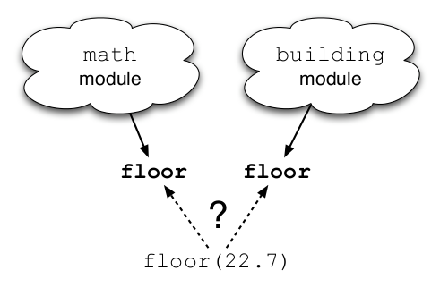

Convert a script to a module
----------------------------

To fix the first, just change the name:

.. sourcecode:: python

    #!/usr/bin/env python
    # calc_squares.py:
    def squares(start, stop):
      for i in range(start, stop):
          print i**2
    squares(0, 10)

.. class:: incremental

    Good, but now if you do ``import calc_squares``, the ``squares(0, 10)`` code
    will still get run!

    There are a couple of ways to deal with this.  The first
    is to look at the module name: if it's ``calc_squares``, then the module is
    being imported, while if it's ``__main__``, then the module is being run as
    a script.

Module-and-script pattern
-------------------------

.. sourcecode:: python

    #! /usr/bin/env python
    # calc_squares.py:
    def squares(start, stop):
      for i in range(start, stop):
         print i**2
    if __name__ == '__main__':
      squares(0, 10)

Now, if you run ``calc_squares.py`` directly, it will run ``squares(0, 10)``;
if you import it, it will simply define the ``squares`` function and leave
it at that.  This is probably the most standard way of doing it.

Module-and-tests pattern
------------------------

I actually prefer a different technique, because of my fondness for testing.
(I also think this technique lends itself to reusability, though.)  I
would actually write two files.

.. sourcecode:: python

    # squares.py:
    __all__ = ["squares"]
    def squares(start, stop):
      for i in range(start, stop):
         print i**2
    def _test_squares():
        pass
    if __name__ == `__main__`:
        import nose
        nose.run()

Script file separate
--------------------

.. sourcecode:: python

    # calc-squares:
    #!/usr/bin/env python
    import squares
    squares.squares(0, 10)

Why split our files this way?
-----------------------------

.. class:: incremental

    First, this is eminently reusable code, because ``squares.py`` is completely
    separate from the context-specific call.

    Second, you can look at the directory listing in an instant and see that
    ``squares.py`` is probably a library, while ``calc-squares`` must be a script,
    because the latter cannot be imported.

Why split (con't)
-----------------

.. class:: incremental

    Third, you can add automated tests to ``squares.py`` (as described below), and run them simply by running ``python squares.py``.

    Fourth, you can add script-specific code such as command-line argument handling to the script, and keep it separate from your data handling and algorithm code.

Packages
--------

.. class:: incremental

    A Python package is a directory full of Python modules containing a
    special file, ``__init__.py``, that tells Python that the directory is
    a package.

    Packages are for collections of library code that are too
    big to fit into single files, or that have some logical substructure
    (e.g. a central library along with various utility functions that all
    interact with the central library).

Sample package
--------------

For an example, look at this directory tree: ::

   package/
     __init__.py    -- contains functions a(), b()
     other.py       -- contains function c()
     subdir/
        __init__.py -- contains function d()

From this directory tree, you would be able to access the functions like
so:

.. sourcecode:: python

   import package
   package.a()
   import package.other
   package.other.c()
   import package.subdir
   package.subdir.d()

What is __init__.py?
--------------------

.. class:: incremental

    Note that ``__init__.py`` is just another Python file; there's nothing special
    about it except for the name, which tells Python that the directory is a
    package directory.

    ``__init__.py`` is the only code executed on import, so if you want names and
    symbols from other modules to be accessible at the package top level, you have
    to import or create them in ``__init__.py``.

Why use packages?
-----------------

There are two ways to use packages:

    1. you can treat them as a convenient code organization technique, and make most of the functions or classes available at the top level

    2. you can use them as a library hierarchy.

__init__.py-heavy packages
---------------------------

In the first case you would make all of the names above
available at the top level: ::

 package/__init__.py:
   from other import c
   from subdir import d
   ...

which would let you do this: ::

   import package
   package.a()
   package.b()
   package.c()
   package.d()

Flat is better, right?
----------------------

That is, the names of the functions would all be immediately available at
the top level of the package, but the implementations would be spread out
among the different files and directories.

**I personally prefer this because I don't have to remember as much ;)**

Submodule-heavy packages
------------------------

The down side is that everything gets imported all at once, which (especially
for large bodies of code) may be slow and memory intensive if you only need a
few of the functions.

If you wanted to keep the library hierarchy, just leave out the top-level
imports.  The advantage here is that you only import the names you need.

**However, you need to remember more.**

Discussion on package trees
---------------------------

Some people are fond of package trees, but I've found that hierarchies
of packages more than two deep are annoying to develop on.

You spend a
lot of your time browsing around between directories, trying to figure
out *exactly* which function you need to use and what it's named.

Using __all__ for cleanup
-------------------------

You can restrict what objects are exported from a module
or package by listing the names in the ``__all__`` variable.  So, if
you had a module ``some_mod.py`` that contained this code:

.. sourcecode:: python

    # some_mod.py:
    __all__ = ['fn1']
    def fn1(...):
    ...
    def fn2(...):
    ...

then only 'some_mod.fn1()' would be available on import.  This is a
good way to cut down on "namespace pollution" -- the presence of
"private" objects and code in imported modules -- which in turn makes
introspection useful.

``with`` statement (1 of 2)
---------------------------

.. sourcecode:: python

    # step 1: open file
    reader = open('foo.txt')
    # step 2: process data in file
    for line in reader:
        pass
    # step 3: close file
    reader.close()

This is a common enough pattern that Python has a way to do it automatically.

``with`` statement (2 of 2)
---------------------------

.. sourcecode:: python

    with open('foo.txt') as reader:
        for line in reader:
            pass
    # automatically closes file upon exit of block

This is one of Python's nicest protocols, called *context manager*.

Context manager
----------------

A context manager is any object that implements two special methods,
``__enter__`` and ``__exit__``.

This ensures common handling for any procedure that tends to have a *setup
step* and a *cleanup step* surrounding actual processing. Common examples:

    * Closing files cleanly after processing them.
    * Setting a decimal context / precision for a certain bit of code, and returning it to original state afterwards.
    * Acquiring a lock and releasing it afterwards.

Dunder protocols
----------------

The context management protocol is an example of a "Dunder Protocol".

http://wiki.python.org/moin/DunderAlias

Rather than rely on type heirarchies like other languages, Python has a
variety of cross-cutting protocols that are implemented using methods
with a double-underscore prefix and suffix. These are sometimes referred
to as "dunder" methods.

Dunder examples
---------------

Some other dunders:

.. class:: incremental

    * ``__init__`` and ``__new__``: for object initialization and creation
    * ``__len__``: for making an object "countable" (can call ``len(x)`` on it)
    * ``__copy__`` and ``__deepcopy__``: for making an object cloneable
    * ``__int__`` and ``__str__``: for type conversions
    * ``__call__``: to make an object *callable*, masquerade as a function
    * ``__iter__``: object is an iterator
    * ``__repr__``: an object's string representation

Format dunders
--------------

.. class:: incremental

    * ``__format__``: used by ``str.format`` interpolation
    * ``__repr``: used by ``repr`` built-in and Python shell
    * ``__str__``: used by ``print`` and many libraries (like Java ``toString``)
    * ``__pprint__``: used specifically by ``pprint`` (pretty print) library, covered later

Dunder for deep magic only
--------------------------

.. class:: incremental

    It has become popular in some open source projects to make use of dunders for internal names. Imitation is a sincere form of flattery, but this is very much recommended *against*.

    The Python maintainers chose dunder because they figured it was a safe place to
    put internal Python protocols that are not likely to ever conflict with user code. You can have your own ``.len()``, ``._len()`` and ``.__len()`` methods, but ``__len__`` is reserved as a protocol with special systemwide meaning.

But Dunders are necessary!
--------------------------

Conversely, many programmers shy away from dunders altogether, thinking that Python maintainers did not intend you to make use of them.

Quite to the contrary: many dunders are downright essential for Python programming, e.g. ``__init__``, ``__repr__`` and ``__hash__``.

PEP8 Discussion
---------------

.. class:: incremental

    You may have noticed that a lot of Python code looks pretty similar.

    This is because there's an "official" style guide for Python

    It's called `PEP 8 <http://www.python.org/dev/peps/pep-0008/>`__.

    It's worth a quick skim, and an occasional deeper read for some sections.

PEP8 Rules
----------

Here are a few tips that will make your code look internally
consistent, if you don't already have a coding style of your own:

    - use four spaces (NOT a tab) for each indentation level;

    - use lowercase, _-separated names for module and function names, e.g.
        ``my_module``;

PEP8 Rules (con't)
------------------

    - use CapsWord style to name classes, e.g. ``MySpecialClass``;

    - use '_'-prefixed names to indicate a "private" variable that should not be used outside this module, , e.g. ``_some_private_variable``;

    - use '__'-prefixed names to indicate truly private variables/methods -- Python's ``object`` type has special handling of these, in fact

Regular expressions
-------------------

.. class:: incremental
    Now that you know about lists, dictionaries, and files, you'll want to be
    able to do something useful with that knowledge.

    A *regular expression* is a powerful domain-specific language for text
    pattern matching.

    Python, like most other modern languages, provides standard library support
    for this powerful tool.

Basic re module
---------------

.. sourcecode:: python

    >>> import re
    >>> RE_EMAIL = r'[\S]+@[\S]+'
    >>> re.match(RE_EMAIL, 'test@nowhere.com')
    <_sre.SRE_Match object at 0x11acac0>
    >>> re.match(RE_EMAIL, 'test@')
    None

Dissecting the e-mail RegExp
----------------------------

.. class:: incremental

    ``>>> RE_EMAIL = r'[\S]+@[\S]+'``

    ``[\S]`` means the *character class* containing any non-whitespace character.
    Could also be written:

    ``[^ \t\n\r\f\v]``

    ``+`` symbol means that any char from that class must occur one or more times.

    ``@`` character is treated as a literal here.

The match object
----------------

.. sourcecode:: python

    >>> match = re.match(RE_EMAIL, 'test@nowhere.com')
    >>> for method in ("span", "start", "end", "groups"):
    ...     print method, getattr(m, method)()
    ('span', (0, 20))
    ('start', 0)
    ('end', 20)
    ('groups', ())

Matching with groups
--------------------

.. class:: incremental

    Regular expressions tend to be used for two purposes: *validation* and *partial matching*.

    **Validation**: if ``Match`` object is returned, it passes; if ``None`` is returned, it fails.

    **Partial Matching**: If ``Match`` object is returned, we break the string into *groups*.

    Imagine if we needed to refer to the username/domain separately in an email address.

Rewrite email RegExp with groups
--------------------------------

.. sourcecode:: python

    >>> import re
    >>> RE_EMAIL = r'(?P<username>[\S]+)@(?P<domain>[\S]+)'
    >>> match = re.match(RE_EMAIL, 'test@nowhere.com')
    >>> match.groups()
    ('test', 'nowehere.com')
    >>> match.groupdict()
    {'domain': 'nowhere.com', 'username': 'test'}

Enhanced email matching
-----------------------

.. sourcecode:: python

    import re
    RE_EMAIL = re.compile(r'''
        (?P<username>[\S]+) # match username portion
        @                   # at sign (@) literal
        (?P<domain>.*)      # match domain portion
    ''', re.VERBOSE)
    match = RE_EMAIL.match('test@google.com')
    print match.span()
    print match.groups()
    print match.groupdict()
    email = match.groupdict()
    print "User entered email domain %s" % email["domain"]
    bad = re.match(RE_EMAIL, "test@")
    print bad

EXERCISES: Sorting and Data
---------------------------

    * http://code.google.com/edu/languages/google-python-class/sorting.html
    * http://code.google.com/edu/languages/google-python-class/dict-files.html
    * http://code.google.com/edu/languages/google-python-class/regular-expressions.html

EXERCISES: Working with File Formats
-------------------------------------

    * http://code.google.com/edu/languages/google-python-class/exercises/baby-names.html
    * http://code.google.com/edu/languages/google-python-class/regular-expressions.html

"Public" and "private" functions
---------------------------------

.. class:: incremental

    Many other programming languages (C++, Java) devote many of their keywords to *access control* -- think keywords like *private*, *public*, and *protected*.

    It may be a surprise that Python has **none of that**.

    Indeed, most Python programmers take "We're all adults here" to its logical conclusion, and declare that privacy is overrated in programming.

Privacy conventions
-------------------

.. sourcecode:: python

    # mymath.py
    __all__ = ["square"]
    _SIZE_CACHE = 20
    _CACHE = [_square(x) for x in range(_SIZE_CACHE)]
    def square(x):
        if x < 0 or x > _SIZE_CACHE:
            # value not in cache
            return _square(x)
        # value is cached, return directly
        return _CACHE[x]
    def _square(x):
        return x**2

Leading underscore on ``_CACHE``, ``_SIZE_CACHE``, and ``_square`` make it clear they aren't *meant* to be used directly.

Modules vs. Singletons
----------------------

.. class:: incremental

    Modules are basically singletons.

    Python programmers don't create singletons, they use modules.

    Modules can contain functions, classes, values, and, through the package mechanism, other modules.

    Good module organization == good code organization in Python.

Importing functions
-------------------

.. sourcecode:: python

    >>> import pprint
    >>> from pprint import pprint as pp

.. class:: incremental

    Importing functions from other modules is probably the simplest form
    of code reuse available in the Python language

    The ``import`` keyword function has a shorthand for aliasing a symbol with the ``as`` keyword

    The ``from...import`` syntax tends to be preferred to direct imports

Consider the alternative
------------------------

.. sourcecode:: python

    >>> import pprint
    >>> pprint = pprint.pprint

.. class:: incremental

    Eek, too many ``pprints``!

    First, a module.

    Then, a label.

    Then, a function within a module of the same name!

Aliasing functions
------------------

.. sourcecode:: python

    >>> from pprint import pprint, pformat
    >>> pf = pformat
    >>> pf is pformat
    True

First-class?
------------

.. class:: incremental

    An integer is 32 bits of data...

    ...that labels can refer to

    A string is a sequence of bytes representing characters...

    ...that labels can refer to

    A function is a sequence of bytes representing instructions...

    ...and yes, labels can refer to them to

    This turns out to be very useful, and very powerful

First-class built-ins
---------------------

.. sourcecode:: python

    >>> def positive(x): return x >= 0
    >>> print filter(positive, [-3, -2, 0, 1, 2])
    [0, 1, 2]

    >>> def negate(x): return -x
    >>> print map(negate, [-3, -2, 0, 1, 2])
    [3, 2, 0, -1, -2]

    >>> def add(x, y): return x+y
    >>> print reduce(add, [-3, -2, 0, 1, 2])
    -2

First-class functions
---------------------

.. sourcecode:: python

    >>> from pprint import pprint
    >>> import sys
    >>> def render(data, methods=None):
    ...     if methods is None:
    ...         methods = (,)
    ...     for method in methods:
    ...         method(data)
    >>> out_methods = (
    ...         pprint,
    ...         lambda data: sys.stdout.write(repr(data))
    ...     )
    >>> render(methods=out_methods)

Dissecting first-class functions
--------------------------------

.. sourcecode:: python

    out_methods = (
       pprint,
       lambda data: sys.stdout.write(repr(data))
    )

.. class:: incremental

    ``pprint`` is just another label, it happens to point at a function.

    ``lambda`` is a special keyword for creating simple anonymous functions using
    a concise syntax.

    functions don't have to live anywhere in particular; here, we're inserting them
    into a 2-tuple labeled ``out_methods``.

First-class functions go anywhere
---------------------------------

.. sourcecode:: python

    >>> render(methods=out_methods)

.. class:: incremental

    Yes, you just passed a 2-tuple of functions to another function as an argument.

    **So what?**

    Other languages make this needlessly difficult (think Anonymous Inner Classes in Java, or ``Runnable`` interface). In Python, no problem.

Higher order function
---------------------

.. class:: incremental

    So, you can pass functions around to other functions.

    Just the same, functions can also *return functions*.

    These are sometimes known as *higher-order functions*.

A function factory
------------------

We declare a function that builds functions.

.. sourcecode:: python

    from re import match
    def regex_factory(pattern):
        def matcher(string):
            match = re.match(pattern, string)
            return match.groups()
        return matcher

And now, to use it:

.. sourcecode:: python

    >>> m = regex_factory("([A-Z]+)([0-9]+)")
    >>> m("ABC009")
    ('ABC', '009')

Optimizing the factory
-----------------------

.. sourcecode:: python

    def precompile_factory_enhance(slow_factory):
        """Higher-order function that optimizes a slow
        function factory that accepts regex patterns
        as its only arg and makes it a fast function
        that uses a compiled pattern."""
        def fast_factory(pattern):
            compiled = re.compile(pattern)
            return slow_factory(compiled)
        return fast_factory
    # replace our old regex_factory with the enhanced one
    regex_factory = precompile_factory_enhance(regex_factory)

.. sourcecode:: python

    >>> m = regex_factory("([A-Z]+)([0-9]+)")
    >>> m("ABC009")
    ('ABC', '009')

Decorators
----------

.. sourcecode:: python

    def simple_func(arg1):
        pass
    simple_func = memoize(simple_func)
    simple_func = debug_log(simple_func)

Decorators were meant to make the use of higher-order functions
easier in Python. Code like the above used to be common, but now,
it can be written more simply.

Decorator example
-----------------

.. sourcecode:: python

    @memoize
    @debug_log
    def simple_func(arg1):
        pass

Star argument application syntax
--------------------------------

Before we talk about decorators, though, we have to understand
some more mechanics about functions. The star argument syntax::

    def decorator(fn):
        def wrapper_fn(*args, **kwargs):
            # ... do something before ...
            val = fn(*args, **kwargs)
            # ... do something after ...
            return val
        return wrapper_fn

    @decorator
    def my_fn(arg1, arg2, default1=None):
        pass

EXERCISES: Functional programming
---------------------------------

    * Write a ``debug_log`` higher-order function that outputs arguments
      passed to a function using ``pprint`` before entering a function
      and outputs the return value after leaving.

    * Write a ``memoize`` higher-order function that takes a function as
      its argument and caches all calls to the underlying function using
      a dictionary.

    * Use the two together for optimizing a fibonacci sequence generator
      function.

Day 3
------

Day 1 was to learn enough to be dangeorus.

Day 2 you became dangerous.

Day 3, young grasshopper, you become **Pythonic**.

The iterator
------------

.. sourcecode:: python

    it = iter(s)
    while 1:
        try:
            item = it.next()
        except StopIteration:
            break
        process(item)

The for loop is "iteration sugar"
---------------------------------

.. sourcecode:: python

    for item in s:
        process(item)

This is the right way to write it.

Implement an iterator
---------------------

If a class supports ``__iter__``, it is said to be ``Iterable``.

The object returned by ``__iter__`` needs to support two methods: ``__iter__`` and ``next``. This object is an ``Iterator``. Think of it like a "cursor" on the sequence, or as a "yielder of values" from the sequence.

The iterator expression
-----------------------

.. sourcecode:: python

    items = [process(item) for item in s]

Python also supports a special syntactic construct that is particularly popular among Pythonistas, known as the *iterator expression* or *list comprehension*.

It is basically a *declarative* version of this code:

.. sourcecode:: python

    items = []
    for item in s:
        items.append(process(item))

List comprehension
------------------

.. sourcecode:: python

    items = [process(item)
                for item in s
                if item in process_list]

These can be very powerful. The above processes and filters a list at once.

List comprehension example (1)
------------------------------

.. sourcecode:: python

    >>> [n ** 2 for n in range(10) if n % 2]
    [1, 9, 25, 49, 81]

List comprehensions example (2)
-------------------------------

.. sourcecode:: python

    >>> words = 'The quick brown fox jumps over the lazy dog'.split()
    >>> [(w.upper(), w.lower(), len(w)) for w in words]
    [('THE', 'the', 3),
    ('QUICK', 'quick', 5),
    ('BROWN', 'brown', 5),
    ('FOX', 'fox', 3),
    ('JUMPS', 'jumps', 5),
    ('OVER', 'over', 4),
    ('THE', 'the', 3),
    ('LAZY', 'lazy', 4),
    ('DOG', 'dog', 3)]

List comprehensions example (3)
-------------------------------

.. sourcecode:: python

    >>> import os
    >>> from glob import glob
    >>> [f for f in glob('*.py*') if os.stat(f).st_size > 6000]

``dict`` and ``set`` comprehensions?
------------------------------------

.. sourcecode:: python

    >>> fstats = dict([(f, os.stat(f)) for f in glob('*py*')])
    >>> owners = set([os.stat(f).st_uid for f in glob('*py*')])
    >>> fstats["ex1.py"]
    posix.stat_result(st_mode=33188, st_mtime=1307117107, ...)
    >>> 1000 in owners
    True

Double listcomps!
-----------------

.. sourcecode:: python

    container = [[1, 2, 3], [2, 3, 4]]
    items = [item
                for nested in container
                for item in nested]

This may be confusing. What does this do?

dict.items vs. dict.iteritems
-----------------------------

.. class:: incremental

    When you start coding declaratively and operating on large datasets, you start to worry about memory.

    ``dict.items`` returns all the items of a dictionary as a brand new list. If your dictionary is big, this can be very wasteful.

    ``dict.iteritems`` returns an *iterator* over the items of your dictionary. Combined with list comprehensions, this can be a memory-efficient way to work with your data.

    In Python 3, ``iteritems`` is gone and ``items`` now returns an iterator. If you want a true clone, you can use ``list(d.items())``.

EXERCISES: Iterators and Iterator Expressions
----------------------------------------------

Create a list of 1000 elements::

    l = range(1000)

And now, perform the following operations on it, generating new lists with list comprehensions:

    * Return a list with the square of every value in the list
    * Return a list with only those numbers whose string representation is exactly two characters, as strings
    * Return a list half the size with pairwise sums

Reading code
------------

.. sourcecode:: python

    >>> [l[i] + l[i+1] for i in range(0, 1000, 2)][0:5]
    [1, 5, 9, 13, 17]

Just because you can doesn't mean you should!

The generator
-------------

Generators take iterators one step further by allowing them to be easily written and lazily evaluated.

.. sourcecode:: python

    def infinity():
        i = 0
        while 1:
            i += 1
            yield i

.. class:: incremental

    Yes, this yields an *infinite* sequence of numbers. (Well, plus or minus overflow)

    But calling ``infinity`` doesn't yield them all at once. It gives you a ``generator`` object, which is an iterator that will return the values specified in the ``yield`` expression!

Generator under the hood
------------------------

.. class:: incremental

    Auto-generates the ``__iter__()`` and ``next()`` methods.

    Saves application state up to the ``yield`` keyword.

    Raises ``StopIteration`` when the generator terminates.

    In combination, these features make it easy to create iterators with no more effort than writing a regular function.

The generator object
---------------------

.. sourcecode:: python

    >>> inf = infinity()
    >>> inf
    <generator object infinity at ... >
    >>> inf.next()
    1
    >>> inf.next()
    2
    >>> for i in range(1000):
    ...     print inf.next(),
    3 4 5 6 7 8 9 ...
    >>> for idx, val in enumerate(infinity()):
    ...     if 1000 > idx > 1005:
    ...         print idx,
    ...     if idx == 5000:
    ...         break
    1001 1002 1003 1004

yield keyword
-------------

.. class:: incremental

    You can think of the ``yield`` keyword similarly to the ``return`` keyword, but with a twist.

    The function containing the ``yield`` is replaced with one that simply returns a ``generator``.

    The generator only executes your function upon first call of the ``.next()`` method. The function runs until it reaches a ``yield``, and when it does, it yields the value and returns it from ``.next()``. But then, execution stops.

    Until the next ``.next()``.

Coroutines
----------

Coroutines are a more exotic form of generator built by using the ``yield`` keyword as an expression rather than as a statement, e.g.

.. sourcecode:: python

    def comment_filter(target):
        while True:
            line = (yield)
            if not line.startswith("#"):
                target.send(line)

Use a coroutine
---------------

So, how do we use one of these things?

.. sourcecode:: python

    def printer_sink():
        while True:
            recv = (yield)
            if recv.startswith("#"):
                continue
            print(recv)
    printer = printer_sink()
    printer.next() # initialize
    sink = comment_filter(printer())
    sink.next()
    sink.send("# commented line")
    sink.send("regular line") # only this will output

Yes, exotic, but great for setting up efficient data pipelines.

Built-ins: range vs. xrange
---------------------------

.. class:: incremental

    Remember range from prior exercises/slides?

    Well, it has a little brother. His name is ``xrange``.

    ``xrange`` yields values in a range, rather than preallocating a big list for it.

    Similarly to iteritems/items, ``xrange`` is removed in Py3 and ``range`` operates this way by default.

Our own ``range``
-----------------

.. sourcecode:: python

    def range(num_ints):
        vals = []
        i = 0
        while i < num_ints:
            vals.append(i)
            i += 1
        return vals

Our own ``xrange``
------------------

.. sourcecode:: python

    def xrange(num_ints):
        i = 0
        while i < num_ints:
            yield i
            i += 1

Generator expressions
---------------------

Similarly to list comprehensions / iterator expressions, generators have a declarative form.

.. sourcecode:: python

    >>> is_even = lambda x: x % 2 == 0
    >>> sum(x for x in xrange(10000) if is_even(x))
    2499950000
    >>> (x for x in xrange(10000))
    <generator object <genexpr> at ...>

Rewriting listcomps as genexps
------------------------------

.. sourcecode:: python

    >>> sum([x**2 for x in range(1000)])
    332833500
    >>> sum(x**2 for x in xrange(1000))
    332833500

What's the difference between them?
-----------------------------------

.. class:: incremental

    Our *listcomps* allocate a new list and populate it with all the values specified in your listcomp expression.

    Meanwhile, *genexps* create a generator object.

    If output is only needed as an input for a function expecting a sequence, you should prefer *genexps*. They will keep memory stable.

    If you need to mutate the list (delete or append elements), you need to stick with *listcomps*.

    Most expressions of form ``fn([listcomp])`` and be rewritten ``fn(genexp)`` safely.

EXERCISES: Generators and Generator Expressions
-----------------------------------------------

    * Start with a list of 100,000 numbers.
    * Set up a pipeline of generators that performs these transformations:
        * square each number
        * truncate to first 4 characters
        * convert to integer

Object-oriented vs. functional programming
-------------------------------------------

.. class:: incremental

    Is Python a functional language?

    Yes.

    Is Python an object-oriented language?

    Yes.

    Is Python schizophrenic?

    Maybe.

Python's style flexing
----------------------

.. class:: incremental

    Perhaps programming paradigms aren't paradigms, but just *states of mind*.

    If you are writing a math utility library, *functions* may be the best organizing principle.

    If you are writing a database-oriented business application, perhaps *classes* and *objects* are appropriate.

    If you are writing a framework that is meant to be both used and extended, maybe some combination of *both* is in order.

The standard library
--------------------

.. class:: incremental

    The standard library shows the flexibility in action.

    ``urllib`` is basically a set of utility functions for dealing with URLs.

    But it can be extended by looking into ``urllib.FancyURLopener``.

    ``pprint`` and ``pformat`` are handy functions for pretty-printing.

    But if you need more, your can extend ``pprint.PrettyPrinter``.

pdb
---

.. sourcecode:: python

    import pdb; pdb.set_trace()

Probably the handiest single line of Python, ever.

Let's take a look at it interactively at the prompt.

Rich debugger
-------------

Tools like WingIDE provide a richer debugger.

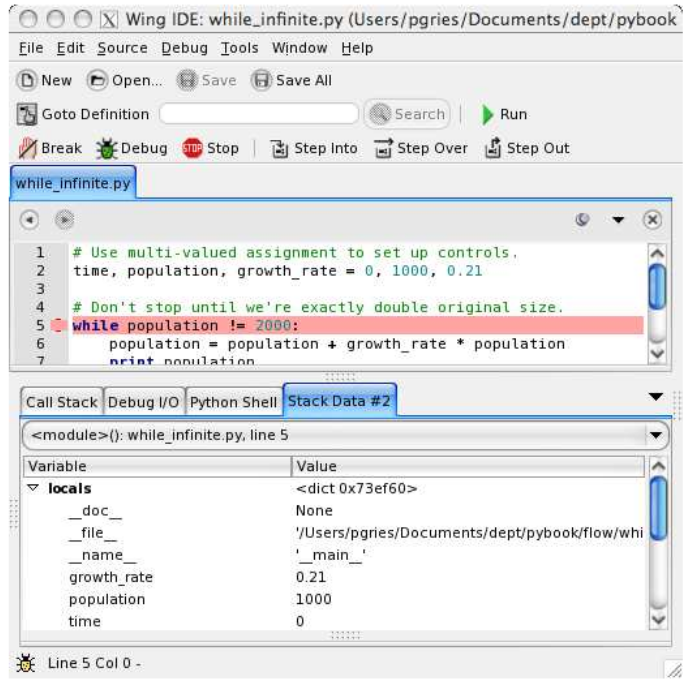

Call stack
----------

Debuggers allow you to navigate the callstack, which is useful for untangling complex, abstracted code.

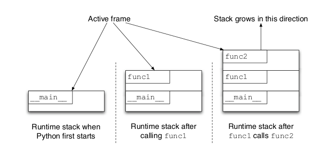

os
--

.. sourcecode:: python

    >>> from os import path
    >>> import os
    >>> files = os.listdir(".")
    >>> for fname in files:
    ...     print path.abspath(fname)
    /home/pixelmonkey/.pip
    /home/pixelmonkey/.rstudio
    ...

No matter how x-platform Python is, it seems we always end up having
to deal with the quirks of our OS.

shutil
------

.. sourcecode:: python

    >>> import shutil
    >>> shutil.copyfile('data.db', 'archive.db')
    >>> shutil.move('build/executables', 'installdir')

EXERCISES: libraries, regex, and system
----------------------------------------

    * http://code.google.com/edu/languages/google-python-class/utilities.html
    * http://code.google.com/edu/languages/google-python-class/exercises/copy-special.html
    * http://code.google.com/edu/languages/google-python-class/exercises/log-puzzle.html

Class syntax
------------

.. class:: incremental

    Just like modules, classes create a new namespace. But they also
    have special handling for class attributes.

    Every class object is a function which, when called, creates an
    instance of the class. There is no ``new`` keyword.

.. sourcecode:: python

    >>> from swfmd import Person
    >>> help(Person)
    >>> person = Person()
    >>> person.<TAB> # (to see methods)

World's simplest class
----------------------

.. sourcecode:: python

    # class with no attributes
    class Person(object): pass
    person = Person()
    # but attributes can be added
    person.first_name = "John Doe"
    person.age = 42

.. class:: incremental

    This is certainly a simple class, but doesn't do much for us.

    Roughly interchangeable with using a ``dict``, except don't need to use string literals to get access to named values.

A simple class for coffee
-------------------------

.. sourcecode:: python

    class CoffeeMaker(object):
        def __init__(self, num_cups, bean="arabica"):
            self.num_cups = num_cups
            self.bean = bean

        def make_coffee(self):
            fmt "made {num_cups} cups of coffee \
                using {bean} beans"
            print fmt.format(num_cups=self.num_cups, bean=self.bean)

.. sourcecode:: python

    >>> c = CoffeeMaker(2)
    >>> c.make_coffee()
    made 2 cups of coffee using arabica beans

Modeling a practical class
--------------------------

.. sourcecode:: python

    from datetime import datetime

    class Employee(object):
        def __init__(self, id_, name, birth_year, role_id=None):
            self.id = id_
            self.name = name
            self.birth_year = birth_year
            self.role_id = role_id
        def get_age(self):
            return datetime.now().year - self.birth_year
        id2role = {
            "FTE": "Full-time Employee",
            "PT": "Part-time Employee",
            "INT": "Intern",
            "CNT": "Contractor"
        }
        def get_role(self):
            if self.role_id is None:
                return None
            return self.id2role.get(self.role_id, "UNKNOWN")

Using the ``Employee`` class
----------------------------

.. sourcecode:: python

    >>> emp1 = Employee(1, "John Doe", 1975, role_id="FTE")
    >>> emp2 = Employee(2, "Jane Doe", 1954, role_id="PT")
    >>> emp3 = Employee(3, "Peter Travis", 1982)
    >>> emp1.get_age()
    36
    >>> emp2.get_role()
    "Part-time Employee"
    >>> emp3.get_role() is None
    True

Stateful methods
----------------

.. sourcecode:: python

    >>> employees = (emp1, emp2, emp3)
    >>> age_sum = sum(employee.get_age() for employee in employees)
    >>> avg_age = age_sum/len(employees)
    >>> print avg_age
    40

More advanced classes
---------------------

.. sourcecode:: python

    import fetchers
    import re
    class Client(object):
        # base URL for Guardian open content API
        base_url = 'http://content.guardianapis.com/'
        # Map paths (e.g. /content/search) to their corresponding methods:
        path_method_lookup = (
            ('^/search$', 'search'),
            ('^/tags$', 'tags'),
            ('^/item/(\d+)$', 'item'),
        )
        def __init__(self, api_key, fetcher=None):
            self.api_key = api_key
            self.fetcher = fetcher or fetchers.best_fetcher()
        def search(self, query):
            self.do_call(query)

A real-world example.

Methods
-------

.. class:: incremental

    Every function declared inside a class body is known as a *method*, which is automatically *bound* to an instance of the class at initialization time.

    Inside a bound method, the first argument, typically named ``self``, contains the instance of the object in question.

The pesky ``self`` convention
------------------------------

.. class:: incremental

    Guido van Rossum, Python's creator, has provided a slew of detail about his choice to require that all methods declared on a class receive a first argument that is the instance of the class.

    Many programmers find this annoying, and wish they could work around it.

    I'm one of those programmers.

    But I'm here to tell you, in practice, you just get used to it and it ain't so bad.

Working around self
-------------------

This seems clever::

    class SuperObj(object):
        def __init__(self, **kwargs):
            self.__dict__.update(**kwargs)

.. sourcecode:: python

    >>> s = SuperObj(name="Andrew", email="andrew@foo.com")
    >>> s.name
    "Andrew"

But it's probably just a crutch.

Not just methods
----------------

.. class:: incremental

    Any non-function attributes are considered "class attributes", and are not treated in any special way. Note these are *shared* for all instances of the class, somewhat similarly to ``static`` properties in other languages.

    Any attributes added to the instance directly using ``self.attr = val`` are considered "instance attributes".

    Sometimes, you'll hear Pythonistas refer to the ``class dictionary`` and the ``instance dictionary``. That's because, under the hood, Python classes are basically fancy dictionaries.

How does attribute lookup work?
-------------------------------

.. class:: incremental

    Attribute lookup is implemented by a special internal method called ``__getattribute__``, which checks the instance ``__dict__`` first, then the class ``__dict__``, and then walks up the class inheritance chain, until it finds a hit or raises ``AttributeError``.

    Magic can also happen due to a dunder method called ``__getattr__``.

    And further magic can happen due to something called *descriptors*.

__init__
---------

At its core, a class is simply a class definition and *typically*, an initialization sequence implemented by ``__init__``.

*Instances* of that class can act either as data containers or, more typically, *bundles of state and behavior*.

__new__
--------

.. class:: incremental

    Whereas ``__init__`` controls object initialization, ``__new__`` runs
    earlier to control object *creation*.

    It is much rarer to use ``new``. One use-case is to cache class instances
    (re-use classes if they have been constructed from equal arguments and
    are stateless).

    Another is to implement singletons, though typically this is a bad idea.

    I tend to stay away from __new__ most of the time.

OO Design with Classes
----------------------

Classes can let you design object-oriented interfaces that are intuitive for business people to grasp.

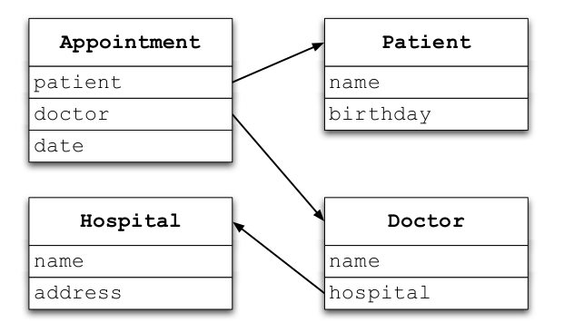

EXERCISES: Classes and introspection
------------------------------------

    * http://blamcast.net/python/ex42.html
    * http://blamcast.net/python/ex45.html

An example interface: tokenizer
-------------------------------

.. class:: incremental

    A *tokenizer* is an object that converts text strings into tokens using some sort of *tokenization algorithm*.

    For example, a tokenizer might convert the sentence ``"The quick brown fox jumps over the lazy dog"`` into a sequence of tokens like ``["the", "quick", "brown", ...]``

Let's do it together
--------------------

Let's do a live coding session where we build our own library of text tokenizers.

We'll then also compare them to tokenizers we can find on the web, and talk about filters and stemmers, as well.

EXERCISES: More Classes and interfaces
--------------------------------------

Your exercise is to define an interface for ``Tokenizer``, and then implement a couple of tokenizers against that interface, such as a whitespace tokenizer, one that recognizes punctuation, etc.

Then, run each tokenizer on the same input using a snippet like this::

    for tokenizer in tokenizers:
        tokenizer.tokenize(string)

A data transformation problem
------------------------------

Here is some CSV data:::

    feature,area
    A,32.5
    A,45.6
    A,42.1
    B,1.5
    B,6.08
    B,5.1
    C,5.9
    C,16.5
    C,32.5
    D,45.6
    D,42.1
    D,6.08

Problem specification
---------------------

Imagine we need to do the following:
    * group by the "feature" column and sum those values, to generate a third column, "sum by feature"
    * for each row, calculate the percentage of the "sum by feature" of a given individual row

Data xform (1)
--------------

.. sourcecode:: python

    from operator import itemgetter
    from collections import defaultdict
    from pprint import pprint

    class Entry(object):
        pass

    with open("areadata.txt") as reader:
        lines = reader.readlines()
        lines = [line.strip().split(",") for line in lines]
        header, data = lines[0], lines[1:]

        def make_entry(row):
            """From a sequence with cols of data, makes an
            object (type Entry) whose attrs are the header
            labels and whose values are the column values."""
            entry = Entry()
            for i, val in enumerate(row):
                setattr(entry, header[i], val)
            return entry

Data xform (2)
--------------

.. sourcecode:: python

    # ... still under with keyword
        for line in lines:
            rows = []
            for row in data:
                # convert values in columns
                column_types = (str, float)
                rows.append([column_types[i](val)
                                for i, val in enumerate(row)])
            # sort rows by first column
            rows = sorted(rows, key=itemgetter(0))
            # sums dictionary holds a mapping of feature => list of
            # area sums; if key is not present, creates an empty list
            sums = defaultdict(list)
            # group values with same feature
            for row in rows:
                entry = make_entry(row)
                sums[entry.feature].append(entry.area)

Data xform (3)
--------------

.. sourcecode:: python

    # ... still under with
        # ... still under for line in lines
            # now that all gathered together, let's sum them
            for key, val in sums.iteritems():
                sums[key] = sum(val)
            # re-iterate over the original list of rows to generate the
            # new derived columns, sum and percent
            for row in rows:
                fmt = "%.2f"
                entry = make_entry(row)
                sum_ = sums[entry.feature]
                row.append(sum_)
                percent = fmt % ((entry.area / sum_) * 100)
                row.append(percent)
                row[1] = fmt % row[1]
                row[2] = fmt % row[2]
        # print the result in a pretty way
        pprint(rows)

Deciding between a function and a class
---------------------------------------

.. class:: incremental

    You might wonder, with all of this flexibility...

    How do I decide between a function and a class?

Some functionality is reserved for classes
------------------------------------------

.. class:: incremental

    * Inheritance and type heirarchies
    * Exception types
    * Attribute lookup customization
    * Operator overloading
    * Most Dunder protocols

For everything else, prefer functions
-------------------------------------

Only take on as much complexity as you actually need!

Exception heirarchy
-------------------

The Python exception heirarchy is easy to grasp, and a good example of a class-based type heirarchy.

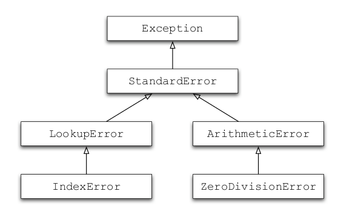

Exception handling in detail
----------------------------

Handling exceptions involves thinking about alternative control flows.

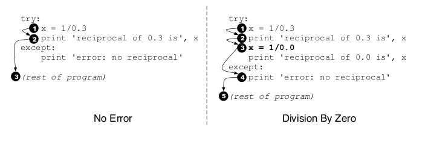

Solvable and Unsolvable Anagrams
--------------------------------

.. sourcecode:: python

    >>> anagram(3, solvable=True)
    "dgo"
    >>> solve("dgo")
    ["god", "dog"]
    >>> anagram(3, solvable=False)
    "xxx"
    >>> solve("xxx")
    None

EXERCISES: Build the Anagram API
--------------------------------

Your program must:
    * Generates solvable and unsolvable anagram puzzles.
    * Exposes this API as both a command-line interface and an interactive interface.
    * Is written as a Python module that can be imported by other code.
    * Is written in object oriented and functional styles so that components can be reused.

A better understanding of Classes
---------------------------------

Python's object orientation capabilities are truly top-notch. We'll explore some ways how in this section.

Property getters
----------------

.. sourcecode:: python

    >>> class B(object):
    ...   def _get_special(self):
    ...       return 5
    ...   special = property(_get_special)
    >>> b = B()
    >>> b.special
    5

Property setters
----------------

.. sourcecode:: python

    >>> class B(object):
    ...   def _get_special(self):
    ...      return 5
    ...   def _set_special(self, value):
    ...      print 'ignoring', value
    ...   special = property(_get_special, _set_special)
    >>> b = B()
    >>> b.special
    5
    >>> b.special = 10
    ignoring 10
    >>> b.special
    5

Rewriting Employee with a property
----------------------------------

.. sourcecode:: python

    from datetime import datetime

    class Employee(object):
        def __init__(self, birth_year):
            self.birth_year = birth_year
        def _get_age(self):
            return datetime.now().year - self.birth_year
        def _set_age(self, age):
            self.birth_year = datetime.now().year - age
        age = property(_get_age, _set_age)

Using the new properties
------------------------

.. sourcecode:: python

    >>> emp = Employee(1984)
    >>> emp.age
    27
    >>> emp.age = 28
    >>> emp.birth_year
    1983

Using the decorator version
---------------------------

.. sourcecode:: python

    from datetime import datetime

    class Employee(object):
        def __init__(self, birth_year):
            self.birth_year = birth_year
        @property
        def age(self):
            return datetime.now().year - self.birth_year
        @age.setter
        def age(self, age):
            self.birth_year = datetime.now().year - age

Descriptor objects
------------------

.. sourcecode:: python

    class Alias(object):
        def __init__(self, attr_name):
            self.attr_name = attr_name
        def __get__(self, obj, type=None):
            return getattr(obj, self.attr_name)
        def __set__(self, obj, value):
            return setattr(obj, self.attr_name, value)

``Alias`` instances are *descriptors*, objects that can be used as a kind
of "attribute guardian".

Using descriptors
-----------------

.. sourcecode:: python

    class Person(object):
        def __init__(self, birth_year):
            self.birth_year = birth_year
            self.nicknames = []
        born_in = Alias("birth_year")
        nicks = Alias("nicknames")

These are used often in frameworks, e.g. Django's ``CharField`` and ``IntField`` types.

An aliased field without data duplication
-----------------------------------------

.. sourcecode:: python

    >>> person = Person(1984)
    >>> person.birth_year
    1984
    >>> person.born_in
    1984
    >>> person.born_in = 1983
    >>> person.birth_year
    1983
    >>> person.nicknames.extend(["Andy", "Drew"])
    >>> person.nicks
    ["Andy", "Drew"]
    >>> person.nicks is person.nicknames
    True

Customizing __repr__ and __str__
---------------------------------

.. sourcecode:: python

    class Person(object):
        def __init__(self, name, gender):
            self.name = name
            self.gender = gender
        def __repr__(self):
            return "<%s name=%s, gender=%s>" % (
                self.__class__.__name__,
                self.name, self.gender)
        char2gender = dict(M="Male", F="Female")
        def __str__(self):
            name = self.name
            gender = self.char2gender.get(self.gender, None)
            if gender is None: return name
            return "%s (%s)" % name, gender

Using ``repr`` and ``str``
--------------------------

.. sourcecode:: python

    >>> person = Person("John Doe", "M")
    >>> person
    <Person name=John Doe, gender=M>
    >>> print person
    John Doe (Male)
    >>> str(person)
    "John Doe (Male)"
    >>> repr(person)
    '<Person name=John Doe, gender=M>'
    >>> person.gender = None
    >>> print person
    John Doe

__getattribute__
-----------------

.. class:: incremental

    Called unconditionally to implement attribute accesses for instances of the class.

    If the class also defines __getattr__(), the latter will not be called unless __getattribute__() either calls it explicitly or raises an ``AttributeError``.

    This method should return the (computed) attribute value or raise an ``AttributeError`` exception.

__getattr__
------------

.. sourcecode:: python

    >>> class A:
    ...    def __getattr__(self, name):
    ...        if name == 'special':
    ...           return 5
    ...        return self.__dict__[name]
    >>> a = A()
    >>> a.special
    5

In *old-style classes*, this was the only way to control attribute access.

Nowadays, it's reserved only for "magic" objects, proxies, and frameworks.

EXERCISES: Build a proxy class
-------------------------------

A proxy class is a class that can wrap any other object to add some functionality to it, but will forward all original requests onto that original object. For example:

.. sourcecode:: python

    >>> person = Person()
    >>> tracer = Tracer(person)
    >>> tracer.birth_year = 1984
    [tracer] setting attribute "birth_year" => 1984
    >>> tracer.compute_age()
    [tracer] calling method "compute_age"
    26

Implement ``Tracer``.

EXERCISES: Build a type heirarchy
---------------------------------

Build a set of classes that represents the data in this diagram.

More standard library
---------------------

Let's take a quick whirlwind tour through some of my favorite stdlib modules.

itertools.groupby
-----------------

.. sourcecode:: python

    >>> is_even = lambda x: x % 2 == 0
    >>> items = sorted(range(1000), key=is_even)
    >>> from itertools import groupby
    >>> odd, even = groupby(items, is_even)
    >>> odd[1].next()
    1
    >>> odd[1].next()
    3
    ...

itertools.product
-----------------

.. sourcecode:: python

    >>> import itertools
    >>> list(itertools.product('ABC', '123'))
    [('A', '1'), ('A', '2'), ('A', '3'),
    ('B', '1'), ('B', '2'), ('B', '3'),
    ('C', '1'), ('C', '2'), ('C', '3')]

itertools.combinations
----------------------

.. sourcecode:: python

    >>> list(itertools.combinations('ABC', 2))
    [('A', 'B'), ('A', 'C'), ('B', 'C')]

itertools.chain
---------------

.. sourcecode:: python

    >>> list(itertools.chain(range(0, 3), range(10, 13)))
    [0, 1, 2, 10, 11, 12]

random
------

.. sourcecode:: python

    >>> import random
    >>> random.choice(['apple', 'pear', 'banana'])
    'apple'
    >>> random.sample(xrange(100), 10)      # sampling without replacement
    [30, 83, 16, 4, 8, 81, 41, 50, 18, 33]
    >>> random.random()                     # random float
    0.17970987693706186
    >>> random.randrange(6)                 # random integer chosen from range(6)
    4

datetime
--------

.. sourcecode:: python

    >>> from datetime import date
    >>> now = date.today()
    >>> now
    datetime.date(2003, 12, 2)
    >>> now.strftime("%m-%d-%y. %d %b %Y is a %A on the %d day of %B.")
    '12-02-03. 02 Dec 2003 is a Tuesday on the 02 day of December.'
    >>> birthday = date(1964, 7, 31)
    >>> age = now - birthday
    >>> age.days
    14368

math
----

.. sourcecode:: python

    >>> import math
    >>> math.cos(math.pi / 4.0)
    0.70710678118654757
    >>> math.log(1024, 2)
    10.0

pickle dump
-----------

.. sourcecode:: python

    import pickle

    data1 = {'a': [1, 2.0, 3, 4+6],
            'b': ('string', u'Unicode string'),
            'c': None}
    selfref_list = [1, 2, 3]
    selfref_list.append(selfref_list)

    output = open('data.pkl', 'wb')

    # Pickle dictionary using protocol 0.
    pickle.dump(data1, output)

    # Pickle the list using the highest protocol available.
    pickle.dump(selfref_list, output, -1)

    output.close()

pickle load
-----------

.. sourcecode:: python

    import pprint, pickle

    pkl_file = open('data.pkl', 'rb')

    data1 = pickle.load(pkl_file)
    pprint.pprint(data1)

    data2 = pickle.load(pkl_file)
    pprint.pprint(data2)

    pkl_file.close()

json
----

.. sourcecode:: python

    >>> import json
    >>> json.dumps(['foo', {'bar': ('baz', None, 1.0, 2)}])
    '["foo", {"bar": ["baz", null, 1.0, 2]}]'
    >>> print json.dumps({'4': 5, '6': 7}, sort_keys=True, indent=4)
    {
        "4": 5,
        "6": 7
    }
    >>> json.loads('["foo", {"bar": ["baz", null, 1.0, 2]}]')
    [u'foo', {u'bar': [u'baz', None, 1.0, 2]}]

collections
-----------

.. sourcecode:: python

    >>> from collections import defaultdict
    >>> s = 'mississippi'
    >>> d = defaultdict(int)
    >>> for k in s:
            d[k] += 1
    >>> d.items()
    [('i', 4), ('p', 2), ('s', 4), ('m', 1)]

urllib / urllib2
----------------

.. sourcecode:: python

    import urllib
    import urllib2
    url = 'http://www.someserver.com/cgi-bin/register.cgi'
    values = {'name' : 'Andrew M',
            'location' : 'Tampa, FL',
            'language' : 'Python' }
    data = urllib.urlencode(values)
    req = urllib2.Request(url, data)
    response = urllib2.urlopen(req)
    page = response.read()

doctest
-------

.. sourcecode:: python

    def average(values):
        """Computes the arithmetic mean of a list of numbers.

        >>> print average([20, 30, 70])
        40.0
        """
        return sum(values, 0.0) / len(values)

    import doctest
    doctest.testmod()   # automatically validate the embedded tests

sqlalchemy (1)
--------------

.. sourcecode:: python

    from sqlalchemy import *

    db = create_engine('sqlite:///tutorial.db')

    db.echo = True

    metadata = MetaData(db)

    places = Table('places', metadata,
        Column('id', Integer, primary_key=True),
        Column('lat', Float),
        Column('lng', Float),
        Column('desc', String(50))
    )
    places.create()

sqlalchemy (2)
--------------

.. sourcecode:: python

    insert = places.insert()
    insert.execute(desc='Wine Toad', lat=39.545, lng=42.4443)
    insert.execute(
            {'desc': 'SWFMD', 'lat': 38.555, 'lng': 43.55},
            {'desc': 'Hampton Inn', 'lat': 34.555, 'lng': 42.55})

    select = places.select()
    resultset = select.execute()

sqlalchemy (3)
--------------

.. sourcecode:: python

    row = resultset.fetchone()
    print 'Id:', row[0]
    print 'Desc:', row['desc']
    print 'Lat:', row.lat
    print 'Lng:', row[places.c.lng]

    for row in resultset:
        print row.desc, 'is @', row.lat, row.lng, 'lat/lng'

sqlalchemy ORM (1)
------------------

.. sourcecode:: python

    from sqlalchemy import *
    from datetime import datetime
    db = create_engine("sqlite:///test.db")
    db.echo = True
    metadata = MetaData(db)

    user_table = Table('acct_users', metadata,
                    Column('id', Integer, primary_key=True),
                    Column('user_name', Unicode(16),
                            unique=True, nullable=False),
                    Column('password', Unicode(40), nullable=False),
                    Column('display_name', Unicode(255), default=''),
                    Column('created', DateTime, default=datetime.now))

    user_table.create()

sqlalchemy ORM (2)
------------------

.. sourcecode:: python

    from sqlalchemy.orm import *

    class User(object):
        def get_dos_password(self):
            self.password.upper()
        def days_since_created(self):
            return (datetime.now() - self.created).days
    mapper(User, user_table)
    Session = sessionmaker()
    session = Session()

    # empty right now
    results = session.query(User)

    user = User()
    user.user_name = "amontalenti"
    user.password = "not a chance"
    session.add(user)
    session.commit()

EXERCISES: Use the standard library
------------------------------------

Build a module that makes an HTTP request to Wikipedia for any given article page, e.g. Barack Obama. What it returns back is the number of occurrences of a string in the article page.

Some requirements:

    * Use ``urllib`` and ``urllib2`` to actually perform the HTTP request.
    * Use a ``defaultdict`` to count the number of occurrences of the search term.
    * Use the ``re`` module to search for the string in each line of the response page.
    * Use ``doctest`` to make sure everything is working properly.

EXERCISES: Compile this presentation!
-------------------------------------

    * Full source code for this presentation is available
    * You can compile it and refer back to it at any time

Baby Turtles
------------

Use your powers wisely, and always remember...

Magic Turtles!
--------------

It's turtles all the way down!

Other great presentations about Python
---------------------------------------

* `Python & Stuff`_ by @japerk
* `Generator Tricks for Systems Programmers`_ by @dabaez

.. _Python & Stuff: http://www.slideshare.net/japerk/python-stuff-10047724
.. _Generator Tricks for Systems Programmers: http://www.dabeaz.com/generators/

Other great Python resources
-----------------------------

* `Python, Good to Great`_ by @jessenoller

.. _Python, Good to Great: http://jessenoller.com/good-to-great-python-reads/

End
----

Fin!

Your host:

Andrew Montalenti, http://pixelmonkey.org

Principal, Aleph Point, http://alephpoint.com

CTO, Parse.ly, http://parse.ly

